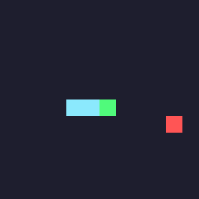

# 🐍 SnakeDQN — Teaching an AI to Play Snake

A Deep Q-Network (DQN) agent that learns to play Snake from scratch, through nothing but trial and error. 
No pre-programmed strategy, no hardcoded rules about "avoid the wall" — just a neural network, a reward signal, 
and a few thousand games to figure it out.



## What this actually is

This started as a class project for my Reinforcement Learning coursework at WGU. The goal was to build an RL agent 
that improves its performance over time in a simulated environment — I picked Snake because it's simple enough to 
reason about but has just enough strategy (don't trap yourself!) to make the learning curve interesting to watch.

The agent starts out moving completely randomly. By the end of training, it's coiling through the grid, eating an 
average of **23 pieces of food per game** — a real, measurable jump from doing nothing.

## How it works

- **`snake_env.py`** — the game itself. A custom Snake environment (no game library needed) that tracks the grid,
- the snake, collisions, and food.
- **`dqn_agent.py`** — the brain. A small neural network built with plain NumPy (no PyTorch/TensorFlow), plus
- experience replay and a target network so training stays stable.
- **`train.py`** — runs the training loop for 2,000 games and saves the results.
- **`play.py`** — loads the trained model and watches it play, no more randomness involved.

The agent doesn't "see" the whole board — it works off 11 simple signals (is there danger straight ahead / left 
/ right, which way is it currently heading, which direction is the food). Keeping the input small like this is part of why training only takes a few minutes on a regular laptop.

## Running it yourself

```bash
pip install -r requirements.txt
python train.py    # trains for ~4-5 minutes, saves results/
python play.py      # watches the trained agent play + generates a GIF
```

## Results

| Metric | Value |
|---|---|
| Average score (final 100 training episodes) | ~19 |
| Average score (20 greedy evaluation games) | 23.15 |
| Best single game | 38 |

Training curves and evaluation charts are in the `results/` folder if you want to see the full learning progression.

## Credits

Built independently, but I leaned on [freeCodeCamp's Snake DQN tutorial](https://www.youtube.com/watch?v=L8ypSXwyBds) 
by Patrick Loeber early on to understand how a project like this is usually structured before writing my own version.

## Full write-up

A full report — algorithms used, dataset details, design decisions, and a discussion of the results — is included in this repo as a Word document.
